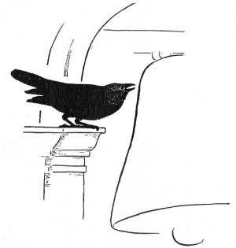

<!--
#################################################
### THIS FILE WAS AUTOGENERATED! DO NOT EDIT! ###
#################################################
# file to edit: _notebooks/2021-07-05-popular-tweets.ipynb
-->

        

<h2 id="This-is-the-code-I-use-to-generate-my-Tweets-page">This is the code I use to generate my <a href="../../../../../tweets">Tweets</a> page</h2>

    
    

    

<pre>import twint
import nest_asyncio
nest_asyncio.apply()

c = twint.Config()

c.Username = &#39;deepfates&#39;
c.Popular_tweets = True
c.Limit = 1
c.Min_likes = 130
tweets = []
c.Store_object = True
c.Store_object_tweets_list = tweets

twint.run.Search(c)
</pre>

    

    

    
    

    

<pre>tweets.sort(key=lambda x: x.datetime, reverse=True)
</pre>

    

    

    
    

    

<pre>from datetime import date

today = date.today()
</pre>

    

    

    
    

    

<pre>def get_include(link):
    return(&#39;&#39;)

def get_md(includes):
    return(f&#39;&#39;&#39;---
layout: page
title: Tweets
permalink: /tweets/
---

I post a lot of tweets.

Here are some of my recent popular posts (not my most popular posts, which I tend to delete when they make me anxious)\n. Last updated {today}
___
\n
{includes}
&#39;&#39;&#39;)
</pre>

    

    

    
    

    

<pre>includes = &#39;\n\n&#39;.join([get_include(t.link) for t in tweets])
</pre>

    

    

    
    

    

<pre>md = get_md(includes)
with open(&#39;../_pages/tweets.md&#39;, &#39;w&#39;) as f:
    print(md, file=f)
</pre>

    

    

 

